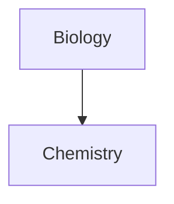

# Überschrift 1
## Überschrift 2
### Überschrift 3
#### Überschrift 4
##### Überschrift 5
###### Überschrift 6

**Fett**
*Kursiv*
***Fett Kursiv***
==Highlight== 
~~Durchgestrichen~~


#tag

[[LinkNichtVorhanden]]
[[Markdown Beispiel|LinkVorhanden]]

>Zitat

> [!Note] Note
> Default (nicht zuklappbar)

> [!BUG] Title
> Contents

> [!error] Title
> Contents

> [!example] Title
> Contents

> [!fail] Title
> Contents

> [!important] Title
> Contents

> [!info] Title
> Contents

> [!question] Title
> Contents

> [!success] Title
> Contents

> [!summary] Title
> Contents

> [!tip] Title
> Contents

> [!todo] Title
> Contents

> [!warning] Title
> Contents

> [!quote] Title
> Contents

> [!INFO]+ Info
> `+` = Default aufgeklappt, aber zuklappbar

> [!EXAMPLE]- Example
> `-` = Default Zugeklappt, aber aufklappbar

1. Liste
	1. Liste
2. Liste

- Liste
- Liste

- [ ] Aufgabe
- [x] Aufgabe

---

`Code`

````js
function fancyAlert(arg) {
  if(arg) {
    $.facebox({div:'Codeblock'})
  }
}
````

%%Kommentar%%

| Spalte      |    Spalte     | Spalte       |
| :---------- | :-----------: | -----------: |
| Linksbündig | Mittiger Text | Rechtsbündig |

$Inline LaTeX$
$$
LatexBlock
$$
