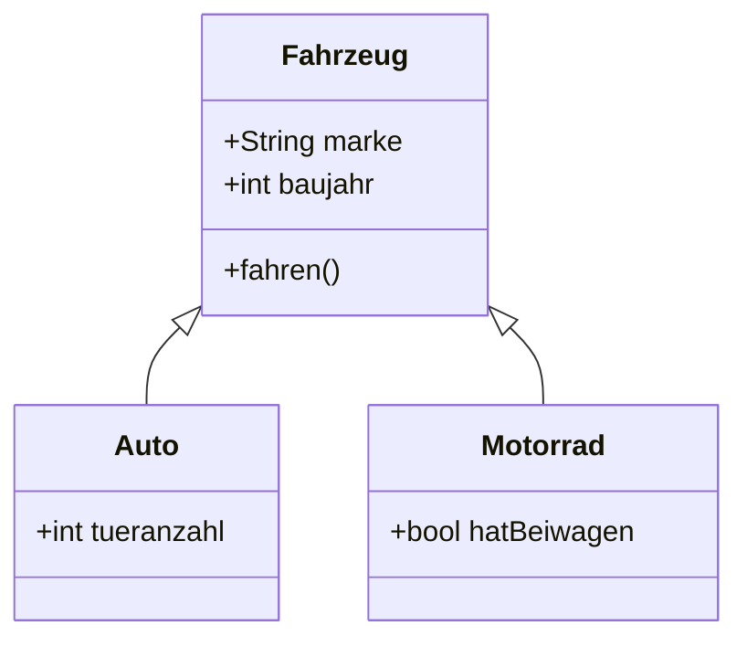

---
Thema:
  - "[[Java]]"
---
>Objektorientierte Programmierung (OOP) basiert auf Klassen und Objekten.  
Eine **Klasse** ist wie ein Bauplan: Sie definiert Eigenschaften (Attribute) und Verhalten (Methoden).  
Ein **Objekt** ist eine konkrete Instanz dieser Klasse – also ein „Ding“, das nach dem Bauplan erstellt wurde.



# Felder / Attribute / Eigenschaften / Membervariablen
---
Dies sind Werte, bzw. Variablen, die mit einer Klasse gespeichert werden können. Attribute und Methoden können genau definiert werden
- public
# Klassen definieren
---
```java
public class Klasse{}
```
# [[Konstruktor]]
---
```java
public class Klasse{
	public Klasse(){
		//do something
	}
	public Klasse(int a){
		//do something else
	}
}
```
Hiermit wird ein Objekt der Klasse erzeugt. Ist in der Klasse kein Konstruktor deklariert, gibt es einen Standardkonstruktor. Ist ein Konstruktor deklariert und er hat Übergabeparameter nennt man den Konstruktor überladen.
# Methoden
---
Methoden sind Funktionen, die innerhalb einer Klasse, bzw. mit einem Objekt aufgerufen werden können.
```java
public class Klasse{
	public int zahl(){
		return 5;
	}
}

Klasse object = new Klasse();
object.zahl();
```
Methoden können auf private Variablen zugreifen.
## Statische Methoden
---
Ist eine Methode in einer Klasse `static` kann sie aufgerufen werden, ohne dass ein Objekt der Klasse erzeugt wird

```java
public class Klasse {
    public static int zahl(){
	    return 5;
    }
}

Klasse.zahl();
```
# Begriffe
---
## Kapselung
Attribute von Klassen werden `private` und es kann nur über Getter und Setter darauf zugegriffen werden. 
## Oberklasse / Superklasse
Die Klasse, wovon Unterklassen erben. Die Superklasse selbst kann auch selbst erben.
## Unterklasse / Subklasse
Eine Unterklasse erbt von einer Superklasse.
## [[Vererbung]]
Attribute und Methoden werden weitergegeben