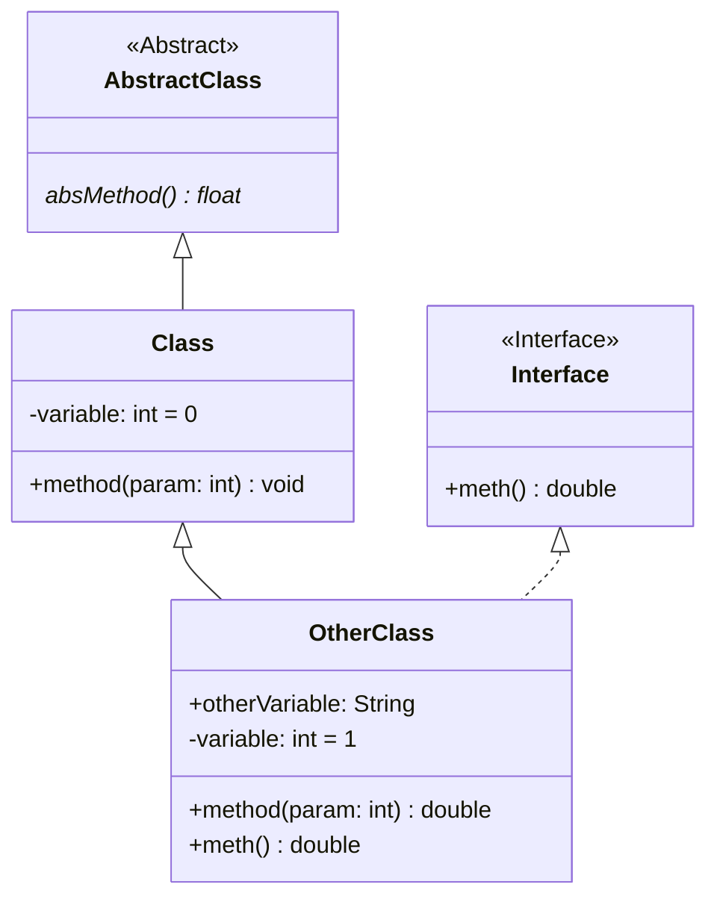
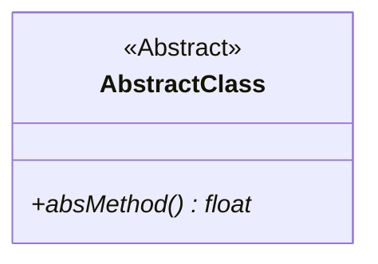
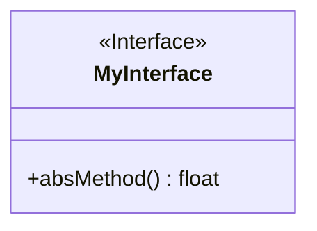

---
tags:
Fach: "[[Programmieren]]"
Thema:
  - "[[Java]]"
---
# Beispiel

# Abstrakte Klassen
---

[[Abstrakte Klassen]] und abstrakte Methoden werden *kursiv* geschrieben. Alternativ kommt hinter den Klassennamen `{abstract}` .
# Interfaces
---

[[Interfaces]] werden mit `<<Interface>>` vor den Namen gekennzeichnet
# Konstruktoren
---
[[Konstruktor|Konstruktoren]] werden, sofern sie nicht **überladen** sind, **nicht** mit angegeben.
# Statische Methoden und Attribute
---
Statische Methoden und Attribute werden in Klassendiagrammen **unterstrichen**.
# Beziehungen
---
![[Pasted image 20250402082851.png]]
# Kennen der Objekte untereinander
---
![[Pasted image 20260611160010.png]]
# Assoziationen
---
## Einfache Assoziationen
![[Pasted image 20251009105659.png]]
- Die Assoziation hat den Namen "besucht"
- Der Pfeil gibt die **Leserichtung** vor
- Die **Leserichtung** wird auch als **ausgemaltes Dreieck** dargestellt
## Multiplizitäten
Multiplizitäten geben an wie viele Objekte der Klassen es geben kann/muss.
![[Pasted image 20251009110301.png]]
### Schreibweisen

| Schreibweise | Erklärung                   |
| ------------ | --------------------------- |
| `m...n`      | Intervall inklusive Grenzen |
| `*`          | beliebig viele              |
| `n`          | feste Anzahl                |
| `n..*`       | mindestens `n`              |
| `*..n`       | maximal `n`                 |
## Aggregation
**Ganzes-Teil-Beziehungen** kennzeichnet mit einer Raute auf der Ganzes-Seite. 
Sie bedeutet, dass es die Einzelteile auch für sich alleine geben kann
![[Pasted image 20251009110750.png]]
## Komposition
Wenn die Teile nicht unabhängig vom Ganzen existieren können, handelt es sich um eine Komposition. Kompositionen werden mit einer ausgefüllten Raute gekennzeichnet.
![[Pasted image 20251009111021.png]]
Die [[#Multiplizitäten|Multiplizität]] auf der Ganzes-Seite ist immer mindestens 1
## Rollen
Man darf zur Verdeutlichung angeben, welche Rolle eine Klasse in einer Assoziation einnimmt.
![[Pasted image 20251009111248.png]]
